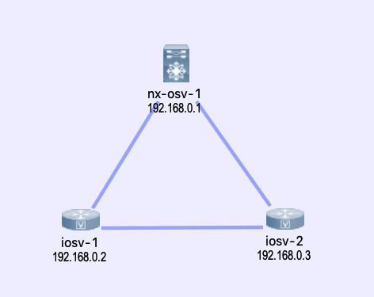

# Cisco  DevNet Create 2019 Network Data Analysis With Elasticsearch, Logstash, and Kibana
Cisco DevNet Create 2019 Presentation Companion

This reponsitory is the companion information to my Tech Talk at the [Cisco DevNet Create 2019](https://developer.cisco.com/devnetcreate/2019), titled "Network Data Analysis with Elasticsearch, Logstash, and Kibana". Since I seems to always forget important details and find missing pieces **after** talks, I hope to at least make up for some of them with this repository. 

*I also welcom any pull requests for any imporovements to this repository*.

### Talk Summary

Many, if not most, business problems can be solved with answering a question search. But few people do, the problem is usually with the search speed and accuracy. In this talk, we will use Elasticsearch, Logstash, and Kibana, also known as the "ELK Stack" to accurately retrieve and analyze network data to derive business conclusion in a timely manner.

### Book

I am working on a related book, currently, it is in its early release that can be purchased on LeanPub with a heavy discount (85% off) and you will receive all the updates along the way until full release: 
[Network Data Analysis with Elasticsearch, Logstash, and Kibana](https://leanpub.com/network-data-analysis-with-elasticsearch-logstash-and-kibana/).


## Useful Links

- Elastic Stack and Product Documentation [Elstic Stack and Proudct Documentation](https://www.elastic.co/guide/index.html)
- ElastiFlow Project [ElastiFlow Project](https://github.com/robcowart/elastiflow)
- Elastic on Cisco UCS Integrated Infrastructure [Elastic on Cisco UCS Integrated Infrastructure](https://www.elastic.co/about/partners/cisco)
- Cisco IOS Syslog Configuration [Cisco IOS Syslog Configuration](https://www.cisco.com/c/en/us/td/docs/ios-xml/ios/bsm/configuration/15-mt/bsm-15-mt-book/bsm-troubleshooting.html)
- Cisco NXOS Syslog Configuration [Cisco NXOS Syslog Configuration](https://www.cisco.com/c/en/us/td/docs/switches/datacenter/nexus9000/sw/6-x/system_management/configuration/guide/b_Cisco_Nexus_9000_Series_NX-OS_System_Management_Configuration_Guide/sm_5syslog.html)
- Cisco IOS NetFlow Configuration [Cisco IOS NetFlow Configuration](https://www.cisco.com/c/en/us/td/docs/ios-xml/ios/netflow/configuration/15-mt/nf-15-mt-book.html)
- Cisco NXOS NetFlow Configuration [Cisco NXOS NetFlow Configuration](https://www.cisco.com/c/en/us/td/docs/switches/datacenter/sw/5_x/nx-os/system_management/configuration/guide/sm_nx_os_cg/sm_15netflow.html)


## Full Demonstration Screencast

**Full Length Demonstration Video**

*Please feel free to jump to different sections below if desired*

[](https://www.youtube.com/watch?v=Z_ktlYGaOO4&list=PLAaTeRWIM_wvwSx5SzH-Y8HhEBD1eqmqw)


## Lab Topology

- I am using Cisco VIRL for the virtual lab, you can find the *topology_simple.virl* file in this repository. 



The full device configuration can be viewed under the *lab_device_configurations* folder, relevant configuration snippets are listed below. 

[](https://www.youtube.com/watch?v=poEa6y2prxk&list=PLAaTeRWIM_wvwSx5SzH-Y8HhEBD1eqmqw)

## Cisco IOSv Device Configuration Snippet

```
iosv-1#sh run
!
vrf definition Mgmt-intf
 !
 address-family ipv4
 exit-address-family
 !
!
interface GigabitEthernet0/0
 description OOB Management
 vrf forwarding Mgmt-intf
 ip address 172.16.1.78 255.255.255.0
!
interface GigabitEthernet0/1
 description to iosv-2
 ip flow ingress
 ip flow egress
!
interface GigabitEthernet0/2
 description to nx-osv-1
 ip flow ingress
 ip flow egress
!
ip flow-export source Loopback0
ip flow-export version 5
ip flow-export destination 172.16.1.118 2055 vrf Mgmt-intf
!
logging host 172.16.1.118 vrf Mgmt-intf transport udp port 5144
!
```

## Cisco NX-OSv Device Configuraiton Snippet 

```
nx-osv-1# sh run

feature netflow

flow exporter flow-exporter-one
  description exportversion9
  destination 172.16.1.118 use-vrf management
  transport udp 2055
  source mgmt0
  version 9
    template data timeout 20
flow record Test
  description IPv4Flow
  match ipv4 source address
  match ipv4 destination address
  match transport destination-port
  collect counter bytes
  collect counter packets
flow monitor Test-Mon
  record Test
  exporter flow-exporter-one

vrf context management

interface mgmt0
  description OOB Management
  duplex full
  vrf member management
  ip address 172.16.1.80/24

interface Ethernet2/1
  description to iosv-1
  ip flow monitor Test-Mon input
  ip flow monitor Test-Mon output

interface Ethernet2/2
  description to iosv-2
  ip flow monitor Test-Mon input
  ip flow monitor Test-Mon output

logging server 172.16.1.118 7 port 5145 use-vrf management
logging source-interface mgmt0
logging monitor 7
```

## Elsticsearch and Kibana Installation

Elasticsearch and Kibana Installation links can be found on the [Elstic Stack Documentation](https://www.elastic.co/guide/index.html) for the OS you are using. In my example, I am using Ubuntu 18.04 LTS and installed the packages via the Debian packages. 

You can install any of the later versions of Elastic Stack, however, you should keep the component vdersions consistent. In my example, all of the components are at version 6.5.4.  

```
echou@elsticsearch-1:~$ uname -a
Linux elsticsearch-1 4.15.0-47-generic #50-Ubuntu SMP Wed Mar 13 10:44:52 UTC 2019 x86_64 x86_64 x86_64 GNU/Linux

echou@elsticsearch-1:~$ lsb_release -a
No LSB modules are available.
Distributor ID:	Ubuntu
Description:	Ubuntu 18.04.1 LTS
Release:	18.04
Codename:	bionic
```

All of the components are installed on the single host in my lab. The lab server are dual-home to my home network as well as the management VM-Net that the routers reside on. 

```
echou@elsticsearch-1:~$ ifconfig
ens160: flags=4163<UP,BROADCAST,RUNNING,MULTICAST>  mtu 1500
        inet 192.168.x.x  netmask x.x.x.0  broadcast 192.168.x.x

ens192: flags=4163<UP,BROADCAST,RUNNING,MULTICAST>  mtu 1500
        inet 172.16.1.118  netmask 255.255.255.0  broadcast 172.16.1.255
        inet6 fe80::20c:29ff:fef4:6d26  prefixlen 64  scopeid 0x20<link>
```

- Check to see if the services are running without error. 
  
[](https://www.youtube.com/watch?v=MzfB2b41LPM&list=PLAaTeRWIM_wvwSx5SzH-Y8HhEBD1eqmqw)

## Data Ingestions - Logstash (and Beats)

- My Logstash configuration is listed below, notice in the input section of different UDP ports and the corresponded tagging of types. At the output section, there is an if / else statement to put the information in the right index. 

- To keep things simple, I have not used any transformation, filters, or Grok patterns. More information can be found in the [Logstash Documentation](https://www.elastic.co/guide/en/logstash/index.html).

- Beats is a light weight data shipper that can sit directly on the host and be aggregated to Logstash or directly to Elasticsearch. Check out [Beats Documentation](https://www.elastic.co/guide/en/beats/libbeat/current/index.html).

```
input {
  udp {
    port => 5144
    type => "syslog-ios"
  }
  udp {
    port => 5145
    type => "syslog-nxos"
  }
  udp {
    port => 2055
    codec => netflow
    type => "netflow"
  }
}

output {
  stdout { codec => rubydebug }
  if "netflow" in [type] {
    elasticsearch {
      hosts => ["http://localhost:9200"]
      index => "cisco-netflow-%{+YYYY.MM.dd}"
    }
  } else {
    elasticsearch {
      hosts => ["http://localhost:9200"]
      index => "cisco-syslog-%{+YYYY.MM.dd}"
    }
  }
}
```
  
[](https://www.youtube.com/watch?v=gPgrGOYnWVs&list=PLAaTeRWIM_wvwSx5SzH-Y8HhEBD1eqmqw)

## Search with Elasticsearch and Visualization with Kibana

- Once the data are in being shipped to Elasticsearch, you can start by creating indices in Kibana. In my example, my Elasticsearch configuration allows for automatic creation of indices when the data is received. 
  
[](https://www.youtube.com/watch?v=JCG4SsdS8eM&list=PLAaTeRWIM_wvwSx5SzH-Y8HhEBD1eqmqw)

- Once the indices are recognized in Kibana, we can start to play around with search directly to gain more knowledge. Once we are satisfied with the results, we can save the search as well as use it for via API calls. 

[](https://www.youtube.com/watch?v=jhEyCyqLu6M&list=PLAaTeRWIM_wvwSx5SzH-Y8HhEBD1eqmqw)

- Many of the search parameters can be tweaked and fine-tuned either in the search URL or request body. 

[](https://www.youtube.com/watch?v=6B6gCzkBZY0&list=PLAaTeRWIM_wvwSx5SzH-Y8HhEBD1eqmqw)

- We can also create visualization via charts. In this example, I am creating a donut-pie chart that separates NetFlow versions and another bar graph to indicate the different sources. Notice the time range selection and real-time update to the graph. 

[](https://www.youtube.com/watch?v=MBfJz9M-nYQ&list=PLAaTeRWIM_wvwSx5SzH-Y8HhEBD1eqmqw)

- We can also aggregate the graph into a dashboard for easy viewing. 

[](https://www.youtube.com/watch?v=ciRyOrZxpoY&list=PLAaTeRWIM_wvwSx5SzH-Y8HhEBD1eqmqw)

## To Do [04/19/2019]

- Give examples of Beats
- More discussion and examples of Search and API
- More visualization examples
- Examples of other tools integration, such as Graphana

