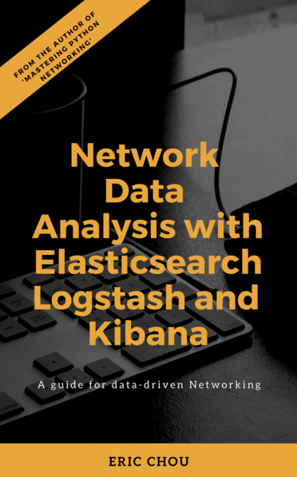

# Cisco  DevNet Create 2019 Network Data Analysis With Elasticsearch, Logstash, and Kibana
Cisco DevNet Create 2019 Presentation Companion

This reponsitory is the companion information to my Tech Talk at the [Cisco DevNet Create 2019](https://developer.cisco.com/devnetcreate/2019), titled "Network Data Analysis with Elasticsearch, Logstash, and Kibana". Since I seems to always forget important details and find missing pieces **after** talks, I hope to at least make up for some of them with this repository. 

*I also welcom any pull requests for any imporovements to this repository*.

### Talk Summary

Many, if not most, business problems can be solved with answering a question search. But few people do, the problem is usually with the search speed and accuracy. In this talk, we will use Elasticsearch, Logstash, and Kibana, also known as the "ELK Stack" to accurately retrieve and analyze network data to derive business conclusion in a timely manner.

### Book

I am working on a related book, currently, it is in its early release that can be purchased on LeanPub with a heavy discount (85% off) and you will receive all the updates along the way until full release: 
[Network Data Analysis with Elasticsearch, Logstash, and Kibana](https://leanpub.com/network-data-analysis-with-elasticsearch-logstash-and-kibana/).



### Useful Links

- Elastic Stack and Product Documentation [Elstic Stack and Proudct Documentation](https://www.elastic.co/guide/index.html)
- ElastiFlow Project [ElastiFlow Project](https://github.com/robcowart/elastiflow)
- Elastic on Cisco UCS Integrated Infrastructure [Elastic on Cisco UCS Integrated Infrastructure](https://www.elastic.co/about/partners/cisco)
- Cisco IOS Syslog Configuration [Cisco IOS Syslog Configuration](https://www.cisco.com/c/en/us/td/docs/ios-xml/ios/bsm/configuration/15-mt/bsm-15-mt-book/bsm-troubleshooting.html)
- Cisco NXOS Syslog Configuration [Cisco NXOS Syslog Configuration](https://www.cisco.com/c/en/us/td/docs/switches/datacenter/nexus9000/sw/6-x/system_management/configuration/guide/b_Cisco_Nexus_9000_Series_NX-OS_System_Management_Configuration_Guide/sm_5syslog.html)
- Cisco IOS NetFlow Configuration [Cisco IOS NetFlow Configuration](https://www.cisco.com/c/en/us/td/docs/ios-xml/ios/netflow/configuration/15-mt/nf-15-mt-book.html)
- Cisco NXOS NetFlow Configuration [Cisco NXOS NetFlow Configuration](https://www.cisco.com/c/en/us/td/docs/switches/datacenter/sw/5_x/nx-os/system_management/configuration/guide/sm_nx_os_cg/sm_15netflow.html)


### Full Demonstration Screencast

](https://www.youtube.com/watch?v=Z_ktlYGaOO4&list=PLAaTeRWIM_wvwSx5SzH-Y8HhEBD1eqmqw)


### Lab Topology

- I am using Cisco VIRL for the virtual lab, you can find the *topology_simple.virl* file in this repository. 


The full device configuration can be viewed under the *lab_device_configurations* folder, relevant configuration snippets are listed below. 

#### Cisco IOSv Device Configuration Snippet

```
iosv-1#sh run
!
vrf definition Mgmt-intf
 !
 address-family ipv4
 exit-address-family
 !
!
interface GigabitEthernet0/0
 description OOB Management
 vrf forwarding Mgmt-intf
 ip address 172.16.1.78 255.255.255.0
!
interface GigabitEthernet0/1
 description to iosv-2
 ip flow ingress
 ip flow egress
!
interface GigabitEthernet0/2
 description to nx-osv-1
 ip flow ingress
 ip flow egress
!
ip flow-export source Loopback0
ip flow-export version 5
ip flow-export destination 172.16.1.118 2055 vrf Mgmt-intf
!
logging host 172.16.1.118 vrf Mgmt-intf transport udp port 5144
!
```

#### Cisco NX-OSv Device Configuraiton Snippet 

```
nx-osv-1# sh run

feature netflow

flow exporter flow-exporter-one
  description exportversion9
  destination 172.16.1.118 use-vrf management
  transport udp 2055
  source mgmt0
  version 9
    template data timeout 20
flow record Test
  description IPv4Flow
  match ipv4 source address
  match ipv4 destination address
  match transport destination-port
  collect counter bytes
  collect counter packets
flow monitor Test-Mon
  record Test
  exporter flow-exporter-one

vrf context management

interface mgmt0
  description OOB Management
  duplex full
  vrf member management
  ip address 172.16.1.80/24

interface Ethernet2/1
  description to iosv-1
  ip flow monitor Test-Mon input
  ip flow monitor Test-Mon output

interface Ethernet2/2
  description to iosv-2
  ip flow monitor Test-Mon input
  ip flow monitor Test-Mon output

logging server 172.16.1.118 7 port 5145 use-vrf management
logging source-interface mgmt0
logging monitor 7
```

### Demonstrations

Full Demon

#### Data Ingestions - Logstash and Beats

placeholder 

#### Search - Elastticsearch

placeholder

#### Visualization - Kibana

placeholder

### Summary

placeholder

